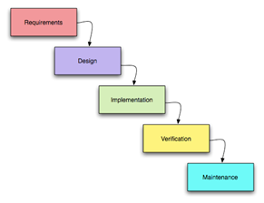
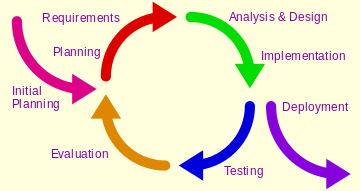
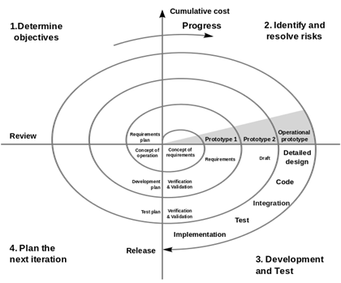
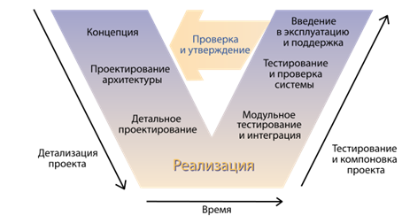
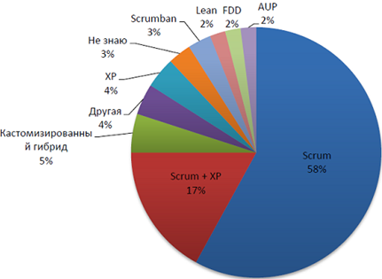
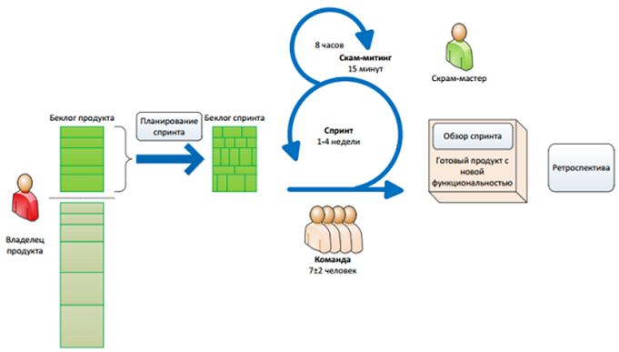
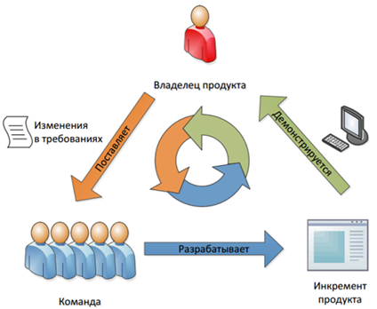

# Практична робота 1. Методологія Scrum. Написання user stories та формування backlog`у продукту

## МЕТА ПРАКТИЧНОЇ РОБОТИ

- вивчити принципи гнучкої методології Scrum;
- визначити користувачів і написати user stories (користувацькі історії) для розроблюваного застосунку;
- сформувати беклог продукту на основі написаних користувацьких історій.

## ЗАВДАННЯ НА ПРАКТИЧНУ РОБОТУ

1. Придумати тему для курсової роботи та заповнити завдання на курсову роботу.
2. Створити репозиторій та оформити його. Створити kanban-дошку з беклогом.
3. Робота з історіями користувачів:
   - Сформувати бачення системи;
   - Визначити користувацькі ролі;
   - Написати користувацькі історії (хоча б для першого спринту):
     - короткий опис;
     - пріоритет (від 1 до 10);
     - критерії приймання;
     - деталі історії.
4. З історій сформувати беклог продукту (пріоритезований список історій).

## ХІД РОБОТИ

Розробку програмного забезпечення можна представити у вигляді набору певних процесів:

- формування вимог до ПЗ (збір та аналіз). Вимоги до ПЗ - це опис функціональних можливостей і обмежень, що накладаються на програмну систему. Успішно розроблене програмне забезпечення - програмне забезпечення, що відповідає вимогам. Результатом цього процесу є сформований SRS (Software Requirement Specification) - закінчений опис програмної системи, яку потрібно розробити;
- на основі сформованих вимог здійснюється проєктування програмного забезпечення - етап розроблення ПЗ, у межах якого досліджуються структура та взаємозв'язки елементів розроблюваної системи. Опрацьовується архітектура системи, визначаються вимоги до програмного забезпечення. Результатом цього процесу є набір документів - проєктна документація (Software Architecture Document, Software Design Document) - набір документів, які можуть містити діаграми, блок-схеми, макети тощо. Проектуються:
  - архітектура (вибір структурних елементів, їхніх інтерфейсів, об'єднання елементів у блоки, спосіб об'єднання цих елементів тощо);
  - пристрій компонентів ПЗ;
  - UI додатка.
- розробка програмного продукту здійснюється на основі розробленої проектної документації. Фактично, на цьому етапі пишеться програмний код - кодуються алгоритми, вибираються і кодуються структури даних. На цьому етапі, як правило, пишеться технічна документація. Результатом цього етапу є написаний програмний код, а також технічна документація;
- тестування програмного забезпечення здійснюється на основі розробленого програмного коду і ставить перед собою дві мети:
  - виявити помилки (ситуації, за яких поведінка програми є неправильною, небажаною або такою, що не відповідає вимогам);
  - продемонструвати замовнику, що ПЗ відповідає вимогам.
- супровід програмного забезпечення відбувається після передачі ПЗ в експлуатацію. На цьому етапі відбувається поліпшення, оптимізація та усунення виявлених дефектів.

Також, як окремі ключові процеси іноді виділяють налагодження програмного забезпечення та впровадження програмного забезпечення:

- налагодження програмного забезпечення - виконується після етапу тестування, полягає в знаходженні, локалізації та усуненні помилок. На відміну від тестування, на етапі налагодження виявляють причину помилки (на етапі тестування відбувається виявлення факту помилки);
- впровадження програмного забезпечення - відбувається після процесу налагодження і полягає у встановленні ПЗ (дуже часто це не просто запуск інсталятора, програмна система може уміщатися на десятках клієнтів, серверів, мобільних пристроїв тощо), налаштуванні ПЗ під умови замовника, а також навчанні користувачів роботі з програмним продуктом.

Послідовність виконання і взаємне відношення цих процесів називають моделлю розробки програмного продукту. Тобто, перераховані вище етапи можуть виконуватися в різних послідовностях, повторюватися, застосовуватися не до всього програмного продукту, а тільки до його частини - все це визначає модель розробки ПЗ. Існує безліч моделей розроблення ПЗ. Наведемо ілюстрації деяких із них:

  

  

  

  

### Гнучка методологія

Гнучка методологія розробки (Agile software development) - серія підходів до розробки програмного забезпечення (початок 00-х років). Суть agile-походу викладено в "маніфесті", але коротко його можна сформулювати так:
- розробка ведеться короткими циклами (ітераціями, називається "спринт") тривалістю 1-4 тижні;
- наприкінці кожної ітерації замовник отримує цінний для нього застосунок (або його частину), який можна використовувати в бізнесі;
- команда розробки співпрацює із замовником під час усього проєкту; зміни в проєкті вітаються і швидко включаються в роботу.

**Agile-маніфест:**

1. Найвищим пріоритетом для нас є задоволення потреб 
замовника, завдяки регулярному та ранньому постачанню цінного програмного 
забезпечення;
2. зміна вимог вітається, навіть на пізніх стадіях розробки. Agile-процеси дають змогу використовувати зміни для забезпечення замовнику конкурентної переваги;
3. Працюючий продукт слід випускати якомога частіше, з періодичністю від кількох тижнів до кількох місяців;
4. Упродовж усього проєкту розробники та представники бізнесу мають щодня працювати разом;
5. Над проектом мають працювати мотивовані професіонали. Щоб робота була зроблена, створіть умови, забезпечте підтримку і повністю довіртеся їм;
6. Безпосереднє спілкування є найбільш практичним та ефективним способом обміну інформацією як із самою командою, так і всередині команди;
7. Працюючий продукт - основний показник прогресу;
8. Інвестори, розробники та користувачі повинні мати змогу підтримувати постійний ритм нескінченно. Agile допомагає налагодити такий стійкий процес розробки;
9. Постійна увага до технічної досконалості та якості проєктування підвищує гнучкість проєкту;
10. Простота - мистецтво мінімізації зайвої роботи - вкрай необхідна;
11. Найкращі вимоги, архітектурні та технічні рішення народжуються у команд, які самоорганізуються;
12. Команда повинна систематично аналізувати можливі способи поліпшення ефективності та відповідно коригувати стиль своєї роботи.

Існує багато методологій гнучкої розробки (XP, Lean, FDD, Scrum, Scrumban тощо). Найбільш популярною з них є Scrum.

  

### Методологія Scrum

Організуйте роботу у вашій організації в невеликих кросфункціональних командах, які містять усіх необхідних фахівців. Виділіть людину - скрам-майстра, який відповідатиме за дотримання процесів у команді та конструктивну атмосферу.

  

Вимоги розбийте на невеликі, орієнтовані на користувачів, функціональні частини, які максимально незалежні одна від одної, в результаті чого отримаєте беклог продукту. Потім упорядкуйте елементи беклогу за їхньою важливістю і зробіть відносну оцінку обсягів кожної історії. Виділіть окрему людину - власника продукту, який відповідатиме за вимоги та їхні пріоритети, замикаючи на себе всіх зацікавлених осіб.

Усю роботу ведіть короткими (від 1 до 4 тижнів) фіксованими ітераціями - спринтами, постачаючи наприкінці кожного з них закінчений функціонал, який можна за потреби вивести на ринок - інкремент продукту. Команда відповідно до своєї швидкості набирає завдання на незмінну за часом ітерацію - спринт.

Щодня проводиться скрам-мітинг, на якому команда синхронізує свою роботу й обговорює проблеми. У процесі роботи члени команди беруть у роботу елементи беклогу згідно з пріоритетом.

Наприкінці кожного спринту проводьте огляд спринту, щоб отримати зворотний зв'язок від власника продукту, і ретроспективу спринту, щоб оптимізувати ваші процеси. Після цього власник продукту може змінити вимоги та їхні пріоритети і запустити новий спринт.

  

#### Ролі

У Scrum заведено виділяти три основні ролі: власник продукту, скрам-майстер і команда:

- Product owner (власник продукту) - це людина, відповідальна за створення вимог та їхню пріоритезацію;
- Scrum-master (скрам-майстер) - член команди, який відповідає за процеси в Scrum (координація роботи, мітинги тощо);
- Команда - розробники, які реалізують вимоги власника продукту.

#### Артефакти (документи для Scrum):

- Product backlog (Беклог продукту) - пріоритезований список вимог з оцінкою трудовитрат. Зазвичай складається з бізнес-вимог, які приносять конкретну бізнес-цінність і називаються елементи бекглога;
- Sprint backlog (беклог спринту) - частина беклогу продукту, з найвищою важливістю і сумарною оцінкою, що не перевищує швидкість команди, відібрана для спринту;
- Інкремент продукту - нова функціональність продукту, створена під час спринту.

#### Беклог продукту

Як було сказано вище, беклог продукту складається з бізнес-вимог, які зазвичай оформляються у вигляді користувацьких історій (user story). Давайте поглянемо детальніше, що являє собою окрема історія користувача:
- унікальний числовий ідентифікатор історії;
- назва історії користувача - короткий опис функціоналу з точки зору користувача, сформульований у вигляді трійки "Роль", "Дія", "Мета";
- важливість - унікальний числовий пріоритет історії користувача, чим вона вища, тим раніше цю історію необхідно зробити;
- оцінка - числова відносна оцінка історії користувача за спеціальною шкалою. У рамках цієї практичної роботи не використовується.

Ці поля є фактично обов'язковими, але досить часто використовуються і додаткові поля:

- докладний опис - текстовий і графічний опис історії користувача. Застосовується, насамперед, у розподілених командах для зберігання знань про функціонал продукту;
- демонстрація - досить докладний сценарій, що дає змогу провести демонстрацію історії користувача. Наприклад, для вищенаведеної історії користувача з авторизацією, можна використовувати такі короткі сценарії для демонстрації:
  - користувач вводить логін "root" і пароль "pass", і переходить на сторінку особистого профілю на сайті;
  - користувач вводить логін "root" і пароль "wrongpass", і отримує повідомлення "Введено неправильний логін або пароль";
- категорія - використовується для підвищення керованості за допомогою категоризації завдань. Як категорії можуть виступати як продуктові категорії ("теми" і "епіки" в термінології Scrum), так і категорії типу "Оптимізація продуктивності", "Технічна історія" тощо.

#### Приклад додатка

Отже, у нас є потреба в реалізації системи, яка б дозволила користувачам зберігати та обмінюватися фотографіями. Очікується, що прибуток від системи буде досягатися за рахунок відсотка з продажу користувачами своїх фотографій, також, можливо, за рахунок реклами третіх компаній.

Це коротке речення - ніщо інше як бачення (vision) системи. Його цілком достатньо для того, щоб почати описувати історії. Але спочатку, давайте ідентифікуємо групи користувачів - історії будуть розказані від їхнього імені. Знання про майбутніх користувачів допоможе нам сфокусуватися на потребах кожного з них, не упустивши важливі моменти у вимогах до системи. І так, різними аспектами системи користуватимуться такі узагальнені користувацькі ролі:

- "користувачі" - зберігають і обмінюються своїми фотографіями;
- "рекламодавці" - розміщують свою рекламу, орієнтовану на "користувачів" системи;
- у результаті обговорення бачення системи виникає необхідність у появі ще однієї ролі "адміністратори" - вони забезпечуватимуть підтримку системи для блага інших користувачів.

Можливо, потім з'являться інші ролі, про які ми поки що не знаємо. Для початку достатньо цих.

Тож, маючи ролі користувачів та їхні основні завдання, спробуємо описати найважливіші історії, які могли б нам розповісти про майбутню систему. Історії пропонується писати в такому форматі:

**Як <користувач>, я можу <дію>, для того, щоб <мета>**

де:

- **<користувач>** - одна з узагальнених користувацьких ролей;
- **<дія>** - дія, що виконується користувачем за допомогою взаємодії із системою;
- **<мета>** - кінцева мета поточного завдання, що виконується користувачем за допомогою взаємодії із системою.**

Цей формат себе добре зарекомендував - він допоможе нам під час продумування і подальшого обговорення історій персоналізувати себе з тими чи іншими користувачами, допомагаючи краще уявити деталі їхньої взаємодії з системою. Останню частину <мета> можна опустити, якщо мета історії і так зрозуміла.

Придумаємо історії:

- як користувач я можу зберігати свої фотографії в системі, щоб мати можливість показати або продати їх іншим користувачам;
- як рекламодавець я можу розміщувати свою рекламу в системі, орієнтовану на користувачів;
- як адміністратор я можу керувати фотографіями користувачів, так щоб контент сайту був легальним.

Під час обговорення першої історії, product owner і команда приходять до того, що користувачі системи повинні бути авторизовані системою перед виконанням будь-яких дій з фотографіями. Це призводить до появи нової користувацької ролі "гостя" - групи людей, які неавторизовані системою або взагалі поки що не мають користувацького облікового запису.

- Як гість я можу зареєструватися в системі для отримання користувацького облікового запису та подальшої роботи;
- Як гість я можу увійти в систему під раніше створеним обліковим записом, для подальшої роботи.

Користуючись принципом симетричності вимог, product owner і замовник ухвалюють рішення, що користувач повинен мати можливість видалити свій обліковий запис у разі потреби:

- Як користувач я можу видалити свій обліковий запис і перестати бути користувачем системи.

Обговорюючи концепцію облікових записів, народжуються також такі історії:

- Як користувач я можу змінити дані свого облікового запису;
- Як користувач я можу зробити деякі поля свого облікового запису видимими для інших користувачів.

Під час обговорення історій product owner і команда приходять до розуміння рівня деталізації, який необхідний на поточній фазі, і приймають спільні рішення, поповнюючи історії дедалі більшою кількістю інформації.

Розглянемо історію

- Як гість я можу зареєструватися в системі для отримання користувацького облікового запису та подальшої роботи.

Під час обговорення цієї історії з командою product owner`у ставлять запитання про те, яка інформація потрібна для створення користувацького облікового запису. Обговорюючи різні варіанти, замовник і команда доходять до того, що для першої версії системи достатньо буде перевіреної електронної адреси плюс імені користувача та його пароля.

До історії дописується цей коментар. Тепер історія має такий вигляд:

- Як гість я можу зареєструватися в системі для отримання користувацького облікового запису і подальшої роботи:
  - Потрібен перевірений email і вибрані користувачем ім'я та пароль.

Під час подальших висловлювань хтось із тестувальників ставить резонне запитання про мінімальну довжину пароля і перевірку на унікальність імені. Продовжуючи дискусію, команда і замовники приходять до думки, що необхідно описати основні критерії готовності історії, щоб команда розуміла очікування і знала, коли оголошувати історію готовою:

- Як гість я можу зареєструватися в системі для отримання користувацького облікового запису та подальшої роботи:
Потрібен перевірений email і обрані користувачем ім'я та пароль.
  - Тест 1: користувач не може ввести пароль менше 6 символів
  - Тест 2: користувач не може ввести ім'я менше 3 і більше 20 символів;
  - Тест 3: користувач повинен мати унікальне ім'я в системі;
  - Тест 4: після реєстрації користувач повинен отримати email для активізації свого облікового запису;
  - Тест 5: користувач не може увійти в систему, якщо обліковий запис не було активізовано;
  - Тест 6: у разі успішного входу система вітає користувача текстом "Ласкаво просимо, <ім'я користувача>"

Можливо, під час реалізації, тестування та приймання історії виникнуть ще якісь додаткові моменти. У цьому випадку вони можуть бути описані у вигляді уточнюючих тестів або як коментарі. Можливо, з цих доповнень з'являться нові історії.

Таким чином історії поповнюються деталями в міру необхідності, еволюціонуючи від коротких висловлювань до деталізованих і узгоджених вимог із вбудованими критеріями готовності.

Користуючись знанням ринку, а також здоровим глуздом, product owner вибудовує список історій таким чином, щоб максимізувати повернення вкладень від проєкту.

- Як гість я можу зареєструватися в системі для отримання користувацького облікового запису та подальшої роботи;
- Як гість я можу увійти в систему під раніше створеним обліковим записом, для подальшої роботи.
- Як користувач я можу зберігати свої фотографії в системі, щоб мати можливість показати або продати їх іншим користувачам.
- Як адміністратор я можу керувати фотографіями користувачів, так щоб контент сайту був легальним.
- Як користувач я можу змінити дані свого облікового запису.
- Як рекламодавець я можу розміщувати свою рекламу в системі, орієнтовану на користувачів.
- Як користувач я можу зробити деякі поля свого облікового запису видимими для інших користувачів.
- Як користувач я можу видалити свій обліковий запис і перестати бути користувачем системи.

Історії збудовані в порядку, який, по-перше, логічний з погляду product owner`а і команди, а по-друге цінність історій зменшується зверху вниз. Таким чином, якщо, наприклад, на половині проєкту настає нестача ресурсів (скажімо, після реалізації історії для адміністратора системи), замовники зможуть отримати вигоду від продукту, оскільки найважливіші історії вже будуть реалізовані.

Крім інструментарію ранжування історій, у руках у замовника є й інші потужні засоби, що дають змогу підвищити ефективність своїх фінансових вкладень. Наприклад, одна з описаних на ранній фазі проєкту історій у якийсь момент може здатися занадто великою порівняно з іншими, що ускладнює розуміння її пріоритету:

- як користувач я можу зберігати свої фотографії в системі, щоб мати можливість показати або продати їх іншим користувачам.

У цьому разі замовник і команда можуть спробувати розбити її на кілька дрібніших історій, кожна з яких може отримати свій пріоритет:

- як користувач я можу зберігати свої фотографії в системі, щоб мати можливість показати їх іншим користувачам;
- Як користувач я можу зберігати свої фотографії в системі, щоб мати можливість продати їх іншим користувачам.

При цьому потрібно врахувати, що початкова історія не розбивається на дві "під-історії", а заміщується двома новими. Це не розбиття історій на підзадачі для постановки їх програмістам, це всього лише переформулювання вимог для більш ефективного управління ними.

#### Модель INVEST

Хороша user story має відповідати моделі "INVEST":

- **I**ndependent. Reduced dependencies = easier to plan (історія має бути, по можливості, незалежна від інших історій);
- **N**egotiable. Details added via collaboration (деталі історії мають доповнюватися в результаті обговорення);
- **V**aluable. Provides value to the customer (історія повинна давати бізнес-цінність замовнику);
- **E**stimable. Too big or too vague = not estimable (історія не повинна бути занадто великою і розпливчастою);
- **S**mall. Can be done in less than a week by the team (історія має бути реалізована менш ніж за тиждень);
- **T**estable. Good acceptance criteria (ясний критерій приймання).

Практичні поради з написання користувацьких історій:

- Краще написати багато історій поменше, ніж кілька громіздких;
- Кожна історія в ідеалі має бути написана, уникаючи технічного жаргону, - щоб клієнт міг пріоритезувати історії та включати їх в ітерації;
- Історії мають бути написані таким чином, щоб їх можна було протестувати;
- Тести мають бути написані до коду;
- Якомога довше варто уникати UI. Історія має виконуватися без прив'язки до конкретних елементів;
- Кожна історія повинна містити оцінку;
- Історія повинна мати кінцівку - тобто приводити до конкретного результату;
- Історія повинна вміщатися в ітерацію.
